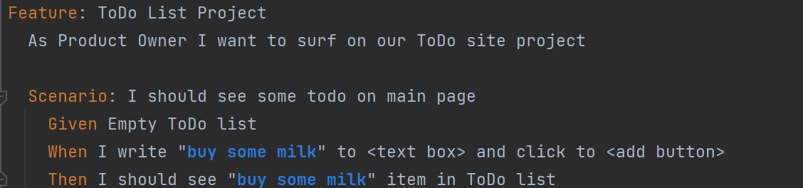
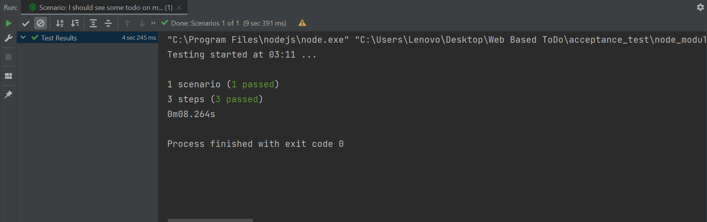
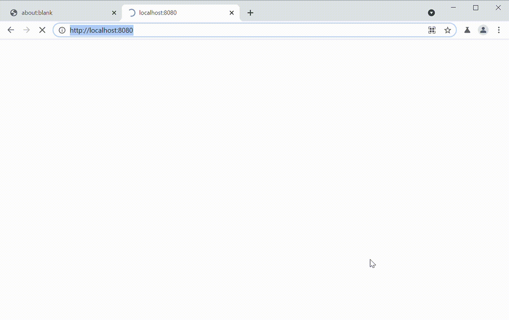

# Acceptance_Test

Acceptance Test of the To Do List Application
 
## To Do List
- [x] 1- User interface for ONLY adding ToDo’s
- [x] 2- Back-end service to store a persistent state of ToDo list
- [x] 3- Writing deployment files of your front-end and back-end

## Tech Stack For Acceptance
1. Acceptance (E2E Test)
 - e2e tests (Cucumber - Puppeteer)
 

The script should pass successfully. After configuring the docker so that the test can run, the tests are running.

``
yarn start
``

## Development Enviroment
### Project Setup
To install the package first

``yarn install
``

